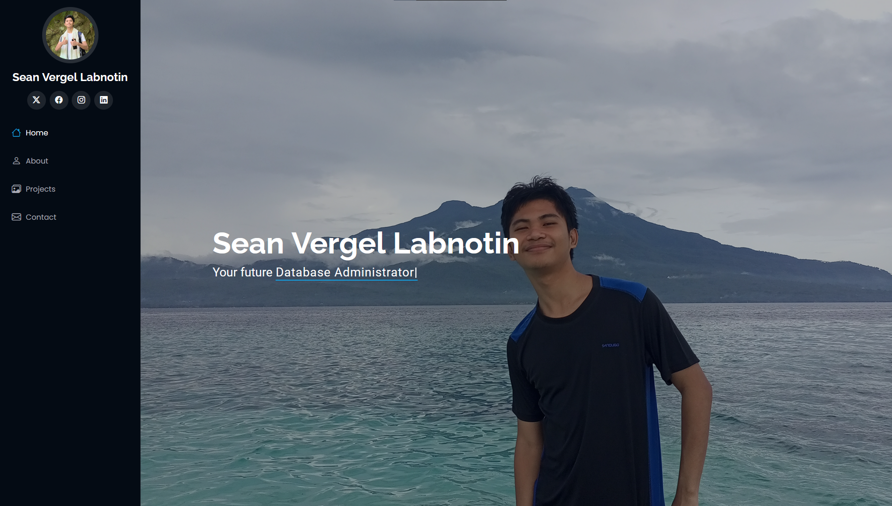

# EPortfolio
CS317 - PERFORMANCE INNOVATICE TASK
# Quick View

# Description of EPortfolio

You can click on <a href="https://svl10.github.io/EPortfolio/">EPortfolio Website</a> to access the link to the website

This is my EPortfolio which includes information about me, my projects, contacts, and skills. It is viewable to tablets, phones, and computers.

# Technology Used
<header>
  <nav>
    <ul>
      <li>HTML</li>
      <li>CSS</li>
      <li>Javascript</li>
      <li>Formspree</li>
      <li>github</li>
      <li>Visual Studio Code</li>
    </ul>
  </nav>
</header>

# Credits to the bootstrap template used:
Bootstrap URL:<a href="https://bootstrapmade.com/iportfolio-bootstrap-portfolio-websites-template/"> bootstrap</a>

Author: BootstrapMade

License: <a href="https://bootstrapmade.com/license/">bootstrap</a>

# How to replicate
<code>git clone https://github.com/svl10/EPortfolio.git </code>
